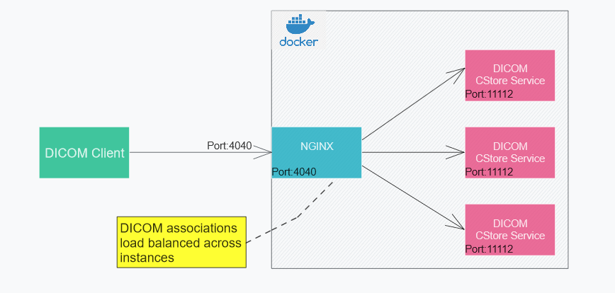

# Docker based Dicom CStore Service 
This project demonstrate load balanced Docker deployment of DICOM CStore service.
## Overview
DICOM CStore service implemented using DCM4CHEE Java library.
Service is deployed inside Docker and instances are scaled and load balanced using nginx.



## Build requirements
- Java 17 or higher
- Functioning Docker setup
### Build instructions
* Checkout  repository
   ```shell
    git clone https://github.com/madhub/dicomservices.git
    ```
* Change to **cstoreservice** directory
   ```shell
    cd cstoreservice
    ```
* Build fat jar
    ```shell
    gradlew.bat clean jar
    ```
* Build Docker image
    ```shell
    docker build -t dicomdemos/dicomstorescp:1.0 . 
    ```
* Confirm Docker image is created successfully
    ```shell
    docker images
    ```
## Deploying service into Docker
Service is deployed using docker-compose with nginx load balancing DICOM assoication across instances.
By default nginx port **4040** published to host. Port **4040** used for all DICOM communications  
* Change to **deployment\docker** directory
 ```shell
    docker-compose up --scale dicomstorescp=3 
  ```
* Verify the DICOM connectivity
  * Using [DCMTK tools](https://dicom.offis.de/download/dcmtk/dcmtk367/bin/dcmtk-3.6.7-win64-dynamic.zip)
    ```shell
      echoscu  localhost 4040 
    ```
  * Using [DCM4CHEE Tools](https://sourceforge.net/projects/dcm4che/files/dcm4che3/5.29.2/)
   ```shell
      storescu  -c store-scp@localhost:4040 
    ```