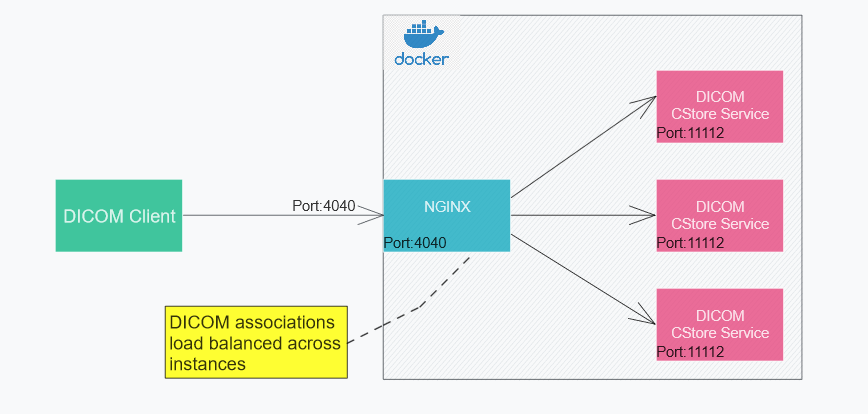

# Docker based Dicom CStore Service 
This project demonstrate load balanced Docker deployment of DICOM CStore service.
## Overview
DICOM CStore service implemented using DCM4CHEE Java library.
Service is deployed inside Docker and instances are scaled and load balanced using nginx.



## Build requirements
- Java 17 or higher
- Functioning Docker setup
### Build instructions
* Build fat jar
    ```shell
    gradlew.bat clean jar
    ```
* Build Docker image
    ```shell
    docker build -t dicomdemos/dicomstorescp:1.0 . 
    ```
* Confirm Docker image is created successfully
    ```shell
    docker images
    ```
* 
